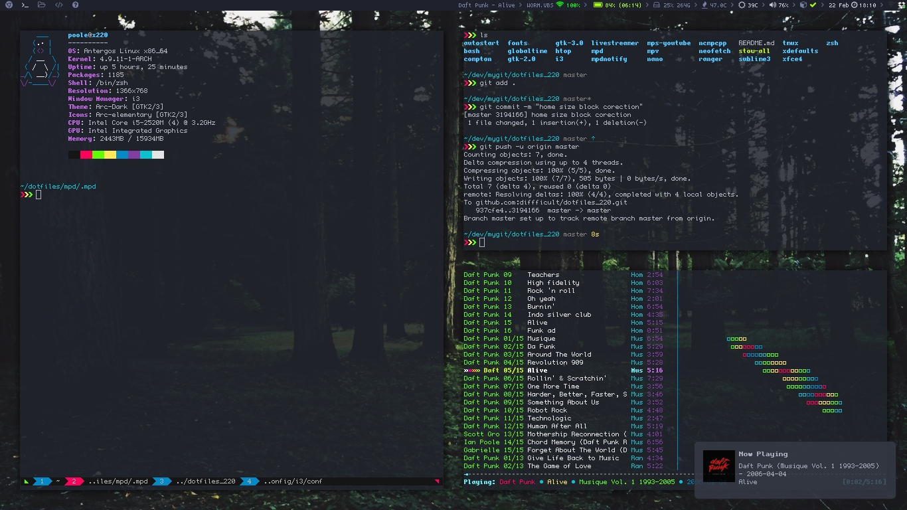

# dotfiles

Current dotfiles managed with a bare Git repository.

### Info

- **wm:** i3-wm
- **bar:** i3bar w/ i3blocks
- **shell:** zsh w/ zprezto
- **editor:** sublime4 & code
- **terminal:** xfce4-terminal + urxvt
- **music player:** ncmpcpp
- **compositor:** picom

### Screenshots

##### In the screenshots
- Screenshot 1
  - ncmpcpp
  - xfce4-terminal + zsh + pure prompt
  - tmux

- Screenshot 2
  - clean desktop
