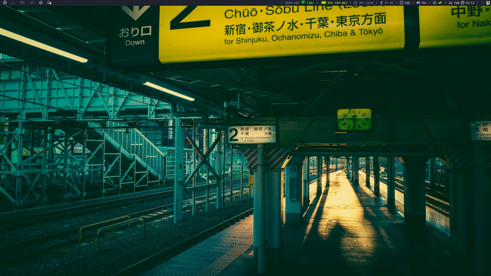

# dotfiles-x220

Current dotfiles on my x220 laptop 

### Info

wm: i3-gaps-git

bar: i3bar w/ i3blocks-gaps-git

shell: zsh

editor: sublime3

terminal: xfce4-terminal+urxvt

music player: ncmpcpp / cava

compositor: compton

### Scrots

##### In the scrots
* Scrot 1
   * ncmpcpp
   
   * xfce4-terminal + zsh + pure prompt
   
   * tmux
   
* Scrot 2
   * clean
